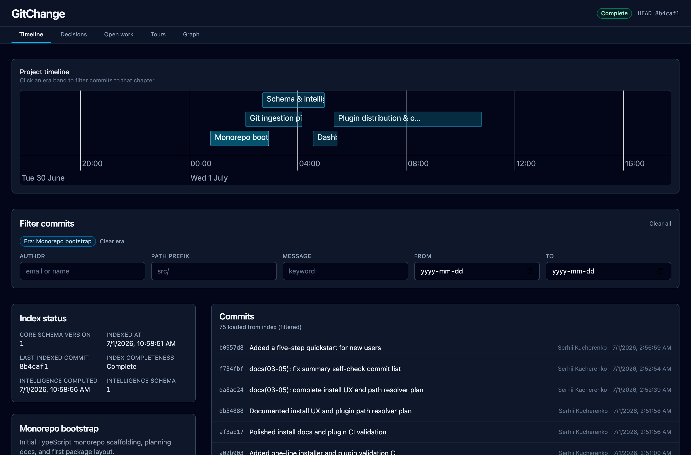
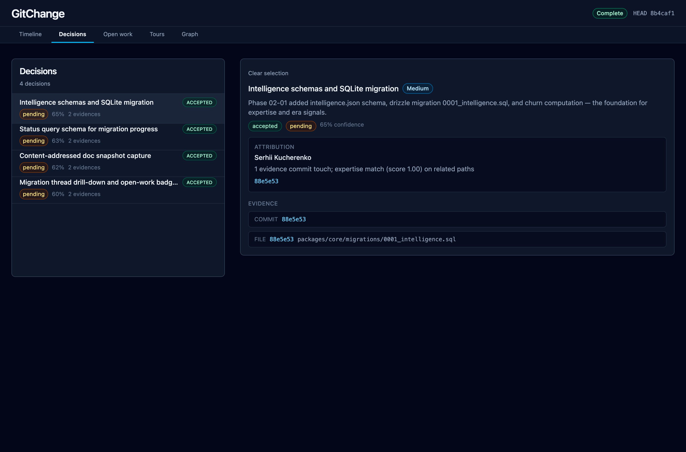
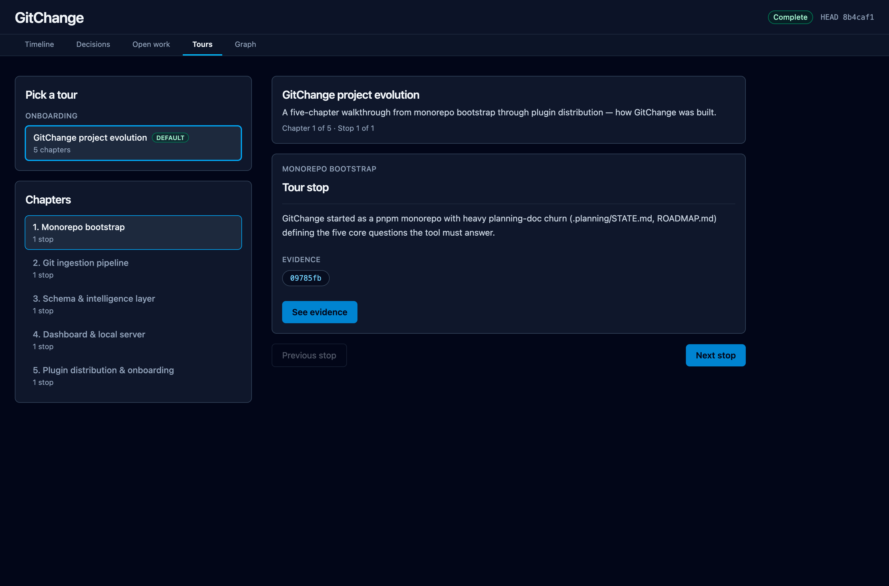
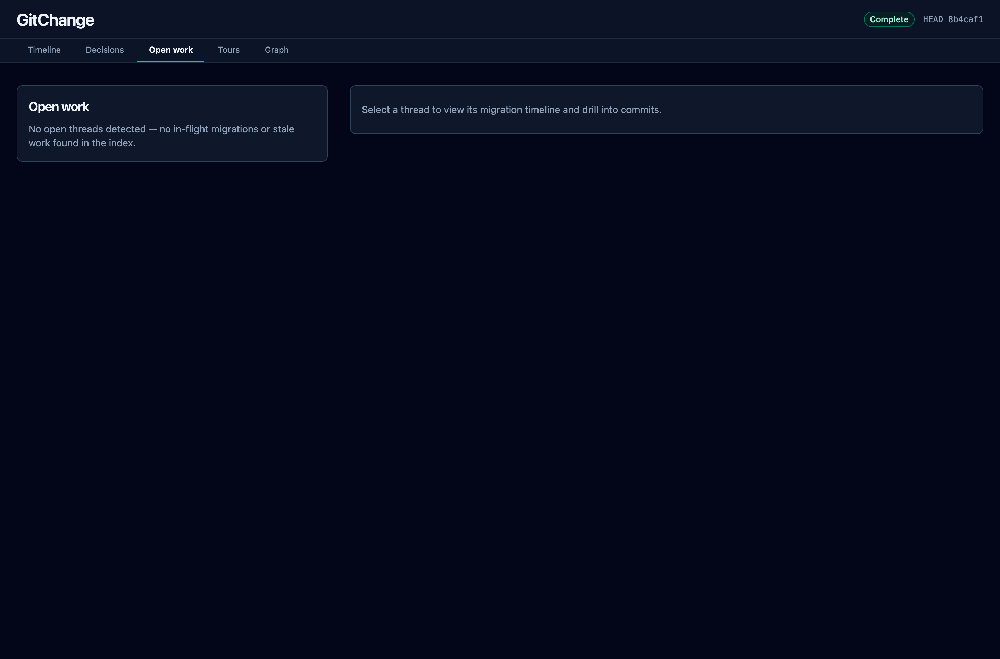

# GitChange

GitChange analyzes git history from a local clone and helps new teammates and maintainers understand how a project evolved — with evidence you can drill into from a local dashboard.

**New here?** Follow the [Quickstart](docs/QUICKSTART.md).

## Dashboard

<p>
  
  
</p>
<p>
  
  
</p>

Every view answers one of GitChange's five core questions with evidence you can drill into — commit SHAs, file paths, and attribution, never a fabricated claim.

## Prerequisites

- **Node.js** 22.x LTS and **pnpm** 11.x
- **git** 2.x on your PATH

## Install

### Cursor (slash commands)

One-line install — clones GitChange, builds, and links `/gitchange` commands into `~/.cursor/commands/`:

```bash
curl -fsSL https://raw.githubusercontent.com/serhii-kucherenko/GitChange/main/scripts/install.sh | bash
```

Open any git repository in Cursor and type **`/gitchange`** in chat. That indexes the repo, summarizes results, and **opens the dashboard automatically**.

Use **`/gitchange-dashboard`** only when you want to re-open the dashboard without re-indexing.

No `GITCHANGE_ROOT`, no manual symlinks. Each `/gitchange` run checks for updates at `~/.gitchange-plugin`, pulls when behind `origin`, and rebuilds if needed.

Set `GITCHANGE_SKIP_UPDATE=1` to disable auto-update (air-gapped or pinned version). Run **`/gitchange-update`** or `gitchange update` anytime to pull the latest release manually.

**Developing GitChange?** From this repo: `bash scripts/install.sh --local`

### Claude Code (marketplace plugin)

GitChange ships as a Claude Code marketplace from this repo (`.claude-plugin/marketplace.json`). You register the repo once, then install the plugin. Slash skills (`/gitchange`, `/gitchange-dashboard`, `/gitchange-interview`) load from the plugin — you do **not** copy `.cursor/commands/`.

**Prerequisites:** Node.js 22.x and pnpm 11.x on your PATH (first `/gitchange` run builds the CLI inside the plugin clone).

**1. Open Claude Code** in a terminal (`claude`) or your IDE integration.

**2. Register the GitChange marketplace** (one time per machine):

```text
/plugin marketplace add serhii-kucherenko/GitChange
```

This clones the repo catalog to `~/.claude/plugins/marketplaces/` so Claude can list what is available. No GitChange commands are installed yet.

**3. Install the GitChange plugin:**

```text
/plugin install gitchange@gitchange
```

Choose **User** scope (works in any git repo) or **Project** scope (shared via this repo’s `.claude/settings.json`).

**4. Confirm it loaded:**

```text
/plugin list
```

You should see `gitchange@gitchange` with skills such as `/gitchange` and `/gitchange-dashboard`. Or run `/plugin` → **Installed** and open the GitChange entry.

**5. Use it:** open any git repository, then run **`/gitchange`** (indexes, summarizes, opens the dashboard). Use **`/gitchange-dashboard`** to re-open only.

**Shell alternative** (same steps, no in-session `/plugin` UI):

```bash
claude plugin marketplace add serhii-kucherenko/GitChange
claude plugin install gitchange@gitchange
```

**Update** after a new GitChange release:

```text
/plugin marketplace update gitchange
```

**If install fails:** ensure the repo is public and step 2 succeeded. If Claude says the plugin is missing, re-run the marketplace add command, then install again. See [Claude Code plugin docs](https://code.claude.com/docs/en/discover-plugins).

### Optional — terminal CLI

Pass `--with-cli` to the install script to also link `~/.local/bin/gitchange`:

```bash
curl -fsSL .../install.sh | bash -s -- --with-cli
```

Add `~/.local/bin` to your PATH, then:

```bash
gitchange --version
gitchange status
```

Override install location:

```bash
GITCHANGE_INSTALL_DIR=~/tools/gitchange curl -fsSL .../install.sh | bash
```

> Overriding `GITCHANGE_REPO_URL` prints a warning — official source is [serhii-kucherenko/GitChange](https://github.com/serhii-kucherenko/GitChange).

## Monorepo development

From a cloned GitChange repo, `.cursor/commands/` in the repo root work directly — no install script needed:

```bash
pnpm install
pnpm build
pnpm test
```

## License

MIT
